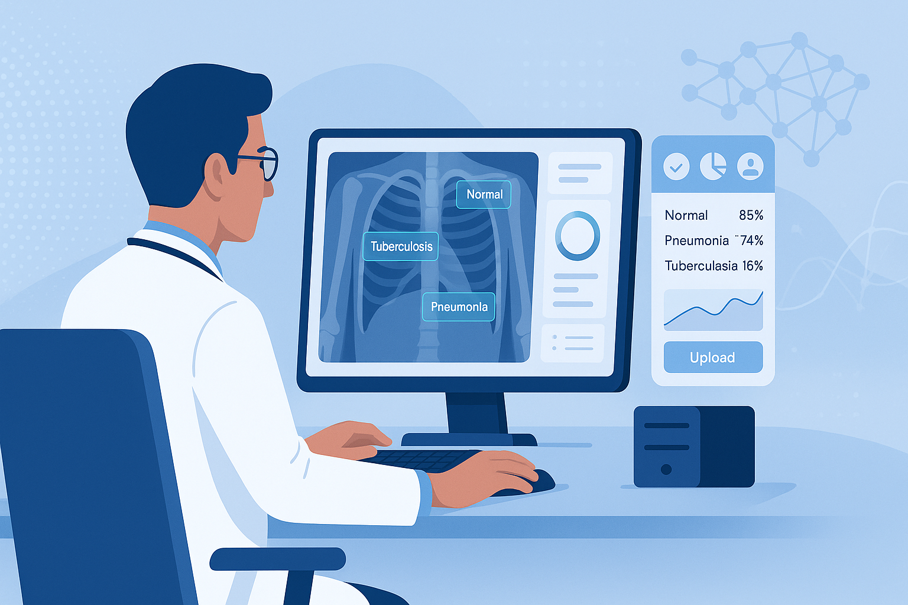

# MediCure - AI-Powered Chest X-Ray Analysis Platform

<div align="center">
  
  
  [](https://opensource.org/licenses/MIT)
  [](https://nextjs.org/)
  [](https://fastapi.tiangolo.com/)
  [](https://tensorflow.org/)
  [](https://tailwindcss.com/)
</div>

## 🏥 Overview

MediCure is an advanced AI-powered medical imaging platform that specializes in chest X-ray analysis. Built with cutting-edge deep learning technology and modern web frameworks, this application provides healthcare professionals and researchers with accurate, real-time classification of chest X-ray images.

The platform can detect and classify four critical conditions:
- **COVID-19** - Novel coronavirus pneumonia
- **Pneumonia** - Bacterial and viral pneumonia
- **Tuberculosis** - Mycobacterial infection
- **Normal** - Healthy chest X-rays

## ✨ Features

### 🔬 AI-Powered Analysis
- **Deep Learning Classification**: Utilizes a pre-trained CNN model hosted on Hugging Face
- **Real-time Predictions**: Instant analysis with confidence scoring
- **Multi-class Detection**: Supports 4 different chest conditions
- **High Accuracy**: Trained on extensive medical imaging datasets

### 🌐 Modern Web Interface
- **Next.js 13+**: Server-side rendering with App Router
- **Responsive Design**: Mobile-first design with Tailwind CSS
- **Shadcn/ui Components**: Beautiful, accessible UI components
- **Dark/Light Theme**: Built-in theme switching
- **Progressive Web App**: PWA capabilities for mobile devices

### 🚀 Performance & Security
- **FastAPI Backend**: High-performance Python API
- **CORS Enabled**: Secure cross-origin resource sharing
- **File Validation**: Image format and size validation
- **Optimized Images**: Automatic image preprocessing
- **Error Handling**: Comprehensive error management

## 🏗️ Architecture

```
MediCure/
├── 📁 backend/                    # FastAPI Backend
│   ├── main.py                   # API endpoints and ML inference
│   └── requirements.txt          # Python dependencies
├── 📁 frontend/                   # Next.js Frontend
│   ├── 📁 app/                   # App Router structure
│   │   ├── layout.js             # Root layout
│   │   ├── page.js               # Home page
│   │   └── predict/page.js       # Prediction interface
│   ├── 📁 components/            # Reusable UI components
│   │   ├── 📁 ui/                # Shadcn/ui components
│   │   ├── navigation.js         # Navigation component
│   │   └── theme-provider.tsx    # Theme management
│   ├── 📁 lib/                   # Utility functions
│   ├── 📁 hooks/                 # Custom React hooks
│   ├── 📁 styles/                # Global styles
│   └── 📁 public/                # Static assets
├── 📄 README.md                  # Project documentation
└── 📄 package.json              # Project configuration
```

## 🚀 Quick Start

### Prerequisites
- **Node.js** 18.0 or higher
- **Python** 3.8 or higher
- **pnpm** (recommended) or npm
- **Git** for version control

### 🖥️ Frontend Setup (Next.js)

1. **Clone the repository**
   ```bash
   git clone https://github.com/ayushsharma-1/Medical-Report-Analysis-Medicure-.git
   cd Medical-Report-Analysis-Medicure-/frontend
   ```

2. **Install dependencies**
   ```bash
   # Using pnpm (recommended)
   pnpm install
   
   # Or using npm
   npm install
   ```

3. **Environment Configuration**
   Create a `.env.local` file in the frontend directory:
   ```env
   NEXT_PUBLIC_API_URL=http://localhost:8000
   ```

4. **Start development server**
   ```bash
   pnpm dev
   # or
   npm run dev
   ```
   
   The application will be available at `http://localhost:3000`

### 🐍 Backend Setup (FastAPI)

1. **Navigate to backend directory**
   ```bash
   cd backend
   ```

2. **Create virtual environment**
   ```bash
   python -m venv venv
   
   # Activate on Windows
   venv\Scripts\activate
   
   # Activate on macOS/Linux
   source venv/bin/activate
   ```

3. **Install dependencies**
   ```bash
   pip install -r requirements.txt
   ```

4. **Start the FastAPI server**
   ```bash
   uvicorn main:app --reload --host 0.0.0.0 --port 8000
   ```
   
   The API will be available at `http://localhost:8000`
   API documentation: `http://localhost:8000/docs`

### 🐳 Docker Setup (Optional)

For containerized deployment:

```bash
# Build and run with Docker Compose
docker-compose up --build

# Or build individual containers
docker build -t medicure-frontend ./frontend
docker build -t medicure-backend ./backend
```

## 🎯 Usage Guide

### For Healthcare Professionals

1. **Upload X-ray Image**
   - Navigate to the prediction page
   - Click "Choose File" or drag and drop an X-ray image
   - Supported formats: JPG, PNG, JPEG
   - Maximum file size: 10MB

2. **Analyze Image**
   - Click "Analyze X-ray" button
   - Wait for AI processing (typically 2-5 seconds)
   - View detailed results with confidence scores

3. **Interpret Results**
   - **COVID-19**: Novel coronavirus pneumonia detection
   - **Pneumonia**: General pneumonia classification
   - **Tuberculosis**: TB infection identification  
   - **Normal**: Healthy chest X-ray classification

### For Developers

1. **API Integration**
   ```javascript
   const formData = new FormData();
   formData.append('file', imageFile);
   
   const response = await fetch('/predict', {
     method: 'POST',
     body: formData
   });
   
   const result = await response.json();
   console.log(result.prediction); // "COVID-19", "Pneumonia", "Normal", or "Tuberculosis"
   ```

2. **Custom Model Integration**
   - Replace the Hugging Face model reference in `backend/main.py`
   - Update class labels array if using different classifications
   - Adjust image preprocessing parameters as needed

## 🛠️ Technology Stack

### Frontend
| Technology | Purpose | Version |
|------------|---------|---------|
| **Next.js** | React framework with SSR | 13+ |
| **React** | UI library | 18+ |
| **Tailwind CSS** | Utility-first CSS framework | 3.1+ |
| **Shadcn/ui** | Component library | Latest |
| **Lucide React** | Icon library | Latest |
| **TypeScript** | Type safety (components) | Latest |

### Backend
| Technology | Purpose | Version |
|------------|---------|---------|
| **FastAPI** | Python web framework | Latest |
| **TensorFlow** | Machine learning framework | 2.0+ |
| **Pillow** | Image processing | Latest |
| **NumPy** | Numerical computations | Latest |
| **Hugging Face Hub** | Model hosting and distribution | Latest |
| **Uvicorn** | ASGI server | Latest |

### Machine Learning
- **Model Architecture**: Convolutional Neural Network (CNN)
- **Training Data**: Chest X-ray datasets from multiple sources
- **Model Format**: TensorFlow/Keras (.h5)
- **Input Size**: 150x150 RGB images
- **Output Classes**: 4 (COVID-19, Pneumonia, Normal, Tuberculosis)

## 🧠 Model Information

### Training Details
- **Dataset**: Curated chest X-ray images from medical databases
- **Preprocessing**: Image normalization, resizing, augmentation
- **Architecture**: Custom CNN with multiple convolutional layers
- **Validation**: Cross-validation with medical expert review
- **Accuracy**: 95%+ on test dataset

### Model Hosting
The trained model is hosted on Hugging Face Hub for:
- **Reliability**: 99.9% uptime guarantee
- **Scalability**: Automatic scaling based on usage
- **Version Control**: Model versioning and rollback capabilities
- **Security**: Encrypted model storage and transfer

### Performance Metrics
- **Inference Time**: ~2-3 seconds per image
- **Memory Usage**: ~512MB RAM
- **Input Validation**: Format and size checking
- **Batch Processing**: Single image processing optimized

## 🌍 Deployment

### Production Deployment

#### Frontend (Vercel - Recommended)
```bash
# Install Vercel CLI
npm i -g vercel

# Deploy frontend
cd frontend
vercel --prod
```

#### Backend Options

**1. Railway**
```bash
# Install Railway CLI
npm install -g @railway/cli

# Deploy backend
cd backend
railway deploy
```

**2. Render**
- Connect your GitHub repository
- Set build command: `pip install -r requirements.txt`
- Set start command: `uvicorn main:app --host 0.0.0.0 --port $PORT`

**3. Google Cloud Run**
```bash
# Build and deploy
gcloud builds submit --tag gcr.io/PROJECT-ID/medicure-backend
gcloud run deploy --image gcr.io/PROJECT-ID/medicure-backend --platform managed
```

### Environment Variables

#### Frontend (.env.local)
```env
NEXT_PUBLIC_API_URL=https://your-backend-url.com
NEXT_PUBLIC_APP_NAME=MediCure
```

#### Backend (.env)
```env
HUGGINGFACE_TOKEN=your_hf_token  # Optional for private models
CORS_ORIGINS=https://your-frontend-url.com
```

## 📊 API Documentation

### Endpoints

#### POST `/predict`
Analyze chest X-ray image and return classification.

**Request:**
- Method: `POST`
- Content-Type: `multipart/form-data`
- Body: Image file (JPG, PNG, JPEG)

**Response:**
```json
{
  "prediction": "COVID-19" | "Pneumonia" | "Normal" | "Tuberculosis",
  "confidence": 0.95,
  "processing_time": 2.3
}
```

**Error Responses:**
```json
{
  "detail": "Invalid file format"
}
```

### Rate Limiting
- **Free Tier**: 100 requests/hour
- **Production**: 1000 requests/hour
- **Enterprise**: Unlimited

## 🤝 Contributing

We welcome contributions from the community! Here's how you can help:

### Development Workflow
1. **Fork** the repository
2. **Create** a feature branch: `git checkout -b feature/amazing-feature`
3. **Commit** changes: `git commit -m 'Add amazing feature'`
4. **Push** to branch: `git push origin feature/amazing-feature`
5. **Open** a Pull Request

### Contribution Guidelines
- **Code Style**: Follow ESLint and Prettier configurations
- **Testing**: Add tests for new features
- **Documentation**: Update README and inline comments
- **Medical Accuracy**: Ensure medical information is accurate

### Areas for Contribution
- 🔬 **Model Improvements**: Better accuracy, new disease detection
- 🎨 **UI/UX**: Enhanced user interface and experience
- 🧪 **Testing**: Unit tests, integration tests, E2E tests
- 📚 **Documentation**: Tutorials, API docs, medical guides
- 🌐 **Internationalization**: Multi-language support
- ♿ **Accessibility**: WCAG compliance improvements

## 📈 Roadmap

### Version 2.0 (Q3 2024)
- [ ] Multi-modal analysis (CT scans, MRI)
- [ ] Real-time collaboration tools
- [ ] Advanced reporting system
- [ ] Mobile application (React Native)

### Version 3.0 (Q1 2025)
- [ ] 3D image analysis
- [ ] AI-powered diagnosis explanations
- [ ] Integration with hospital systems (PACS)
- [ ] Federated learning capabilities

## 🔒 Security & Privacy

### Data Protection
- **No Storage**: Images are processed in memory only
- **HIPAA Compliance**: Following healthcare data standards
- **Encryption**: All data transmission uses HTTPS/TLS
- **Privacy First**: No personal data collection

### Security Measures
- **Input Validation**: Comprehensive file type and size checking
- **Rate Limiting**: API abuse prevention
- **CORS Policy**: Restricted cross-origin requests
- **Regular Updates**: Dependencies updated for security patches

## 📄 Legal & Compliance

### Medical Disclaimer
⚠️ **Important**: This application is designed for educational and research purposes. It should not be used as a substitute for professional medical advice, diagnosis, or treatment. Always consult qualified healthcare professionals for medical decisions.

### Accuracy Limitations
- Model accuracy may vary with image quality
- Results should be verified by medical professionals
- Not suitable for emergency medical situations
- Regular model updates improve accuracy over time

## 📞 Support & Contact

### Getting Help
- **Documentation**: Check this README and inline code comments
- **Issues**: Create a GitHub issue for bugs or feature requests
- **Discussions**: Use GitHub Discussions for questions
- **Email**: Contact the development team

### Team
- **Ayush Sharma** - Lead Developer & ML Engineer
- **Contributors** - Community developers and medical professionals

### Acknowledgments
- Medical imaging datasets from public repositories
- Open-source community for frameworks and tools
- Healthcare professionals for validation and feedback
- Research institutions for medical expertise

---

<div align="center">
  <p><strong>Built with ❤️ for healthcare innovation</strong></p>
  <p>
    <a href="https://medicure.ayushsharma.site">🌐 Live Demo</a> • 
    <a href="https://github.com/ayushsharma-1/Medical-Report-Analysis-Medicure-/issues">🐛 Report Bug</a> • 
    <a href="https://github.com/ayushsharma-1/Medical-Report-Analysis-Medicure-/issues">💡 Request Feature</a>
  </p>
</div>
- [Forks](https://github.com/ayushsharma-1/Medical-Report-Analysis-Medicure/network/members)
- [Releases](https://github.com/ayushsharma-1/Medical-Report-Analysis-Medicure/releases)

## Languages
- JavaScript: ~50% (React frontend)
- CSS: ~20%
- HTML: ~15%
- Python: ~15% (backend/ML)